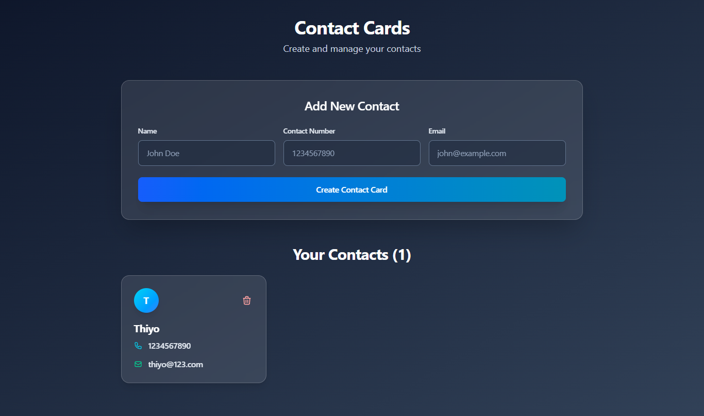

# Contact Cards Manager 📇

A modern, responsive React application for creating and managing contact cards with local storage persistence. Features a beautiful dark theme with glass morphism effects and Satoshi font.


## ✨ Features

- **🎨 Modern UI** - Dark theme with glass morphism effects
- **📱 Responsive Design** - Works perfectly on desktop, tablet, and mobile
- **💾 Local Storage** - Data persists between browser sessions
- **🎯 Easy Management** - Add and delete contacts effortlessly
- **⚡ Fast & Lightweight** - Built with React and Tailwind CSS
- **🔄 Real-time Updates** - Instant UI updates when managing contacts
- **📧 Contact Details** - Store name, phone number, and email

## 🚀 Live Demo

[Visit the Live Website](https://contact-recat.netlify.app/)

## 📸 Screenshot



## 🛠️ Installation

1. **Clone the repository**
   ```bash
   git clone https://github.com/yourusername/contact-cards-manager.git
   cd contact-cards-manager
   ```

2. **Install dependencies**
   ```bash
   npm install
   ```

3. **Start the development server**
   ```bash
   npm start
   ```

4. **Open your browser**
   Navigate to `http://localhost:3000`

## 📦 Build for Production

```bash
npm run build
```

## 🎨 Customization

### Changing Colors
The app uses Tailwind CSS. Modify the color scheme in the component:

```jsx
// Current gradient background
bg-gradient-to-br from-slate-900 to-slate-700

// Change to different colors
bg-gradient-to-br from-gray-900 to-blue-900
```

### Modifying Font
The app uses Satoshi font. To change fonts:

1. Update the font import in the component
2. Modify `tailwind.config.js`:
```js
theme: {
  extend: {
    fontFamily: {
      sans: ['Your-Font', 'system-ui', 'sans-serif'],
    },
  },
}
```

## 🏗️ Project Structure

```
src/
├── App.js                 # Main component
├── index.js              # App entry point
├── screenshot.png        # Project screenshot
└── components/           # (Optional) Additional components
```

## 💡 Usage

1. **Adding a Contact**
   - Fill in the name, contact number, and email
   - Click "Create Contact Card"
   - The card will appear instantly and be saved to localStorage

2. **Deleting a Contact**
   - Click the delete icon (trash can) on any contact card
   - The card will be removed immediately

3. **Data Persistence**
   - All contacts are automatically saved to browser localStorage
   - Contacts persist between browser sessions and page refreshes

## 🛠️ Technologies Used

- **React 18** - UI framework
- **Tailwind CSS** - Styling and responsive design
- **HTML5 LocalStorage** - Data persistence
- **Satoshi Font** - Modern typography
- **CSS3** - Glass morphism effects and animations

## 🔧 Component Details

### Main Features
- **State Management**: React hooks (`useState`, `useEffect`, `useRef`)
- **Form Handling**: Uncontrolled components with refs
- **Data Persistence**: Automatic localStorage synchronization
- **Responsive Grid**: CSS Grid with Tailwind responsive classes

### Key Functions
- `submit()` - Handles new contact creation
- `deleteCard()` - Removes contacts
- `useEffect()` - Loads saved data on component mount

## 🎯 Browser Support

- Chrome (latest)
- Firefox (latest)
- Safari (latest)
- Edge (latest)

## 🤝 Contributing

1. Fork the project
2. Create your feature branch (`git checkout -b feature/AmazingFeature`)
3. Commit your changes (`git commit -m 'Add some AmazingFeature'`)
4. Push to the branch (`git push origin feature/AmazingFeature`)
5. Open a Pull Request

## 📝 License

This project is licensed under the MIT License - see the [LICENSE.md](LICENSE.md) file for details.

## 🙏 Acknowledgments

- [Satoshi Font](https://www.fontshare.com/fonts/satoshi) for the beautiful typography
- [Tailwind CSS](https://tailwindcss.com) for the utility-first CSS framework
- [React](https://reactjs.org) for the amazing framework

## 📞 Support

If you have any questions or issues, please open an issue on GitHub.

---

**⭐ Star this repo if you found it helpful!**

---

<div align="center">

### Made with ❤️ using React and Tailwind CSS

</div>
